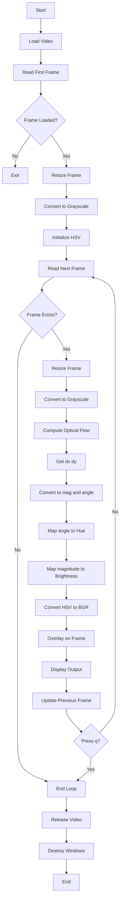

# Dense Optical Flow using the Farneback Algorithm

- Objective
    
    Compute and visualize **pixel-wise motion** between consecutive video frames using dense optical flow and overlay it as a heatmap.
    
- Input
    - Video file (`.mp4`)
    - Continuous frames from the video stream
- Output
    - Real-time visualization of motion
    - Color-coded flow map overlaid on video
    
    ```mermaid
    flowchart TD
    	A[Start] --> B[Load video]
    	B --> C[Read first frame]
    	C --> D[Convert to grayscale]
    	D --> E{Next frame available?}
    	E -- Yes --> F[Read next frame]
    	F --> G[Convert to grayscale]
    	G --> H[Compute dense optical flow<br>Farneback]
    	H --> I[Convert flow to magnitude and angle]
    	I --> J[Map to HSV / heatmap colors]
    	J --> K[Overlay flow visualization on frame]
    	K --> L[Display result]
    	L --> M[Set current = next]
    	M --> E
    	E -- No --> N[Release video and close windows]
    	N --> O[End]
    ```
    
- Procedure:



### ▶ Step 1: Video Capture

```
cap=cv2.VideoCapture('path_to_video')
ret,frame1=cap.read()
```

- Opens the video file and reads the first frame
- `ret` checks if frame was successfully loaded

Optical flow requires **two consecutive frames** to compute motion.

---

### ▶ Step 2: Resize & Convert to Grayscale

```
frame1=cv2.resize(frame1, (0,0),fx=scale,fy=scale)
prvs=cv2.cvtColor(frame1,cv2.COLOR_BGR2GRAY)
```

- Resize reduces computation (fewer pixels)
- Convert to grayscale (optical flow uses intensity, not color)

Motion is detected using **brightness changes**, not RGB values.

---

### ▶ Step 3: Initialize HSV Image

```
hsv=np.zeros_like(frame1)
hsv[...,1]=255
```

- Creates blank HSV image for visualization
- Sets saturation to maximum for bright colors

HSV is used to represent:

- Direction → color
- Speed → brightness

---

### ▶ Step 4: Frame Processing Loop

```
whileTrue:
ret,frame2=cap.read()
```

- Reads frames continuously from video

Each iteration compares:

```
previous frame (prvs)
current frame (frame2)
```

---

### ▶ Step 5: Preprocess Current Frame

```
frame2=cv2.resize(frame2,(0,0),fx=scale,fy=scale)
next_gray=cv2.cvtColor(frame2,cv2.COLOR_BGR2GRAY)
```

- Same preprocessing as first frame
- Ensures consistency for optical flow calculation

---

### ▶ Step 6: Compute Optical Flow

```
flow=cv2.calcOpticalFlowFarneback(
prvs,next_gray,None,
0.5,3,15,3,5,1.2,0
)
```

- Computes motion vector for every pixel

Output:

```
flow[y, x] = (dx, dy)
```

Where:

- `dx` → horizontal movement
- `dy` → vertical movement

Farneback method approximates motion using **polynomial expansion**.

---

### ▶ Step 7: Convert to Magnitude & Angle

```
mag,ang=cv2.cartToPolar(flow[...,0],flow[...,1])
```

- Converts `(dx, dy)` → `(magnitude, direction)`

Meaning:

- `mag` → speed of motion
- `ang` → direction of motion

---

### ▶ Step 8: Map Motion to HSV

### Direction → Hue

```
hsv[...,0]=ang*180/np.pi/2
```

- Converts angle to color

---

### Magnitude → Brightness

```
hsv[...,2]=cv2.normalize(mag,None,0,255,cv2.NORM_MINMAX)
```

- Faster motion → brighter pixels

---

### ▶ Step 9: Convert HSV to BGR

```
rgb_flow=cv2.cvtColor(hsv,cv2.COLOR_HSV2BGR)
```

- Converts HSV image to BGR for display

---

### ▶ Step 10: Overlay on Original Frame

```
combined=cv2.addWeighted(frame2,0.7,rgb_flow,0.3,0)
```

- Blends motion map with original frame

Formula:

```
output = 0.7 × frame + 0.3 × motion
```

💡 Purpose:

Shows motion while keeping original context visible.

---

### ▶ Step 11: Display Output

```
cv2.imshow("Dense Optical Flow",combined)
```

- Displays real-time visualization

---

### ▶  Step 12: Update Previous Frame

```
prvs=next_gray
```

- Current frame becomes previous frame

Without this, motion would always be computed relative to the first frame (incorrect).

---

### ▶ Step 13: Exit Condition

```
ifcv2.waitKey(1)&0xFF==ord('q'):
break
```

- Press **q** to stop execution

---

### ▶ Step 14: Cleanup

```
cap.release()
cv2.destroyAllWindows()
```

- Releases video resources
- Closes all windows
